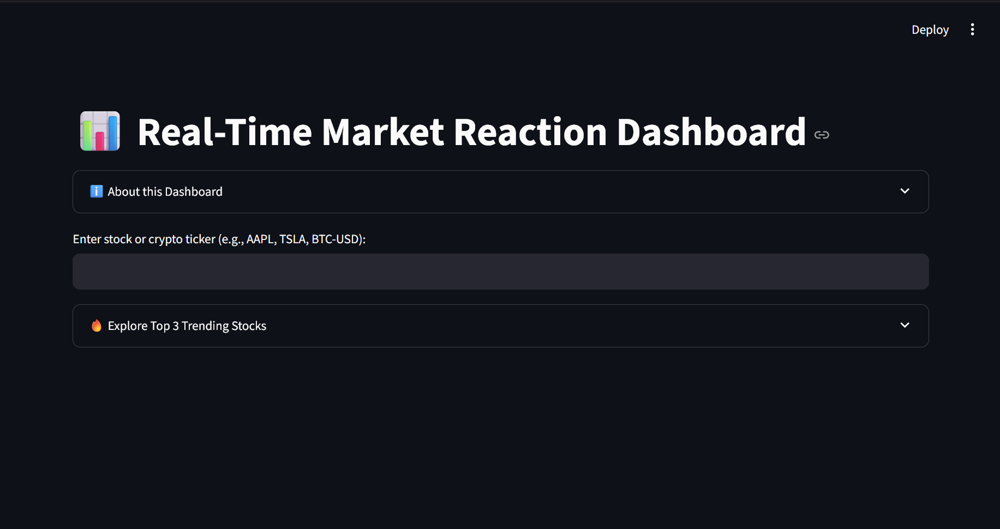
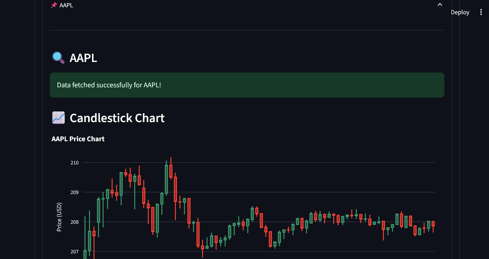
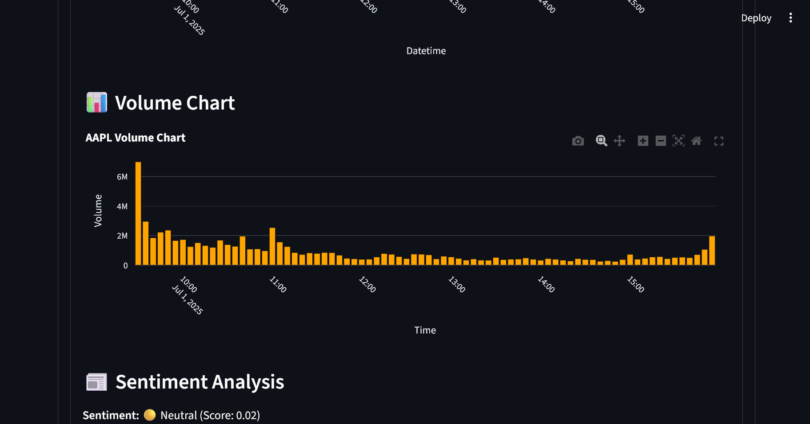
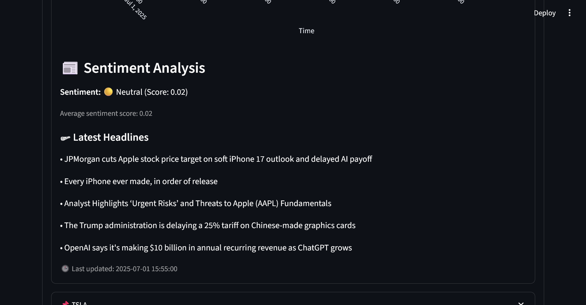

## 📌 Description for GitHub `README.md`

# 📊 Real-Time Market Reaction Dashboard

A dynamic, interactive market dashboard that fetches real-time stock or cryptocurrency data and displays it using candlestick and volume charts — enriched with live sentiment analysis based on the latest news.

This project combines data visualization, sentiment analytics, and web app deployment using Python and Streamlit, perfect for showcasing real-world skills in finance, data science, and web tech.

---

## 🚀 Features

- 🔍 **Live Ticker Input** (e.g., AAPL, TSLA, BTC-USD)
- 📈 **Candlestick Price Chart** using Plotly
- 📊 **Volume Chart** for trade activity
- 📰 **News Headlines** pulled from NewsAPI
- 💬 **Sentiment Analysis** of news headlines (TextBlob-based, customizable)
- 🔥 **Top 3 Trending Stocks** (AAPL, TSLA, NVDA) in expandable cards
- 🧠 **Beginner-Friendly Explanation** loaded from `welcome.md`
- 🧩 Modular architecture for easy extension
- 🌙 Dark theme UI using Streamlit + Plotly

---

## 🧠 Why This Project?

Unlike basic dashboards, this project:
- ✅ Merges **real-time financial data** with **natural language sentiment**
- ✅ Gives users actionable insight, not just charts
- ✅ Is built using **deployable, modern Python tools**
- ✅ Is beginner-friendly *yet powerful enough* to stand out on a resume

---

## 🛠 Built With

- **Python 3.10+**
- `yfinance` — for market data
- `plotly` — for candlestick & bar charts
- `streamlit` — to create an interactive web dashboard
- `requests` — to call NewsAPI
- `TextBlob` — for sentiment scoring
- `pandas` — for data manipulation

---

## 💡 How to Run

1. Clone the repo:
   ```bash
   git clone https://github.com/YOUR_USERNAME/market-dashboard.git
   cd market-dashboard
    ```

2. Install requirements:

   ```bash
   pip install -r requirements.txt
   ```

3. Set your NewsAPI key in `.streamlit/secrets.toml`:

   ```toml
   NEWS_API_KEY = "your_news_api_key_here"
   ```

4. Run the app:

   ```bash
   streamlit run app.py
   ```

---

## 📌 Screenshots





---

## 🧠 Credits

Built with ❤️ by Anushree Balaji
For portfolio, practice, and learning purposes.

```
